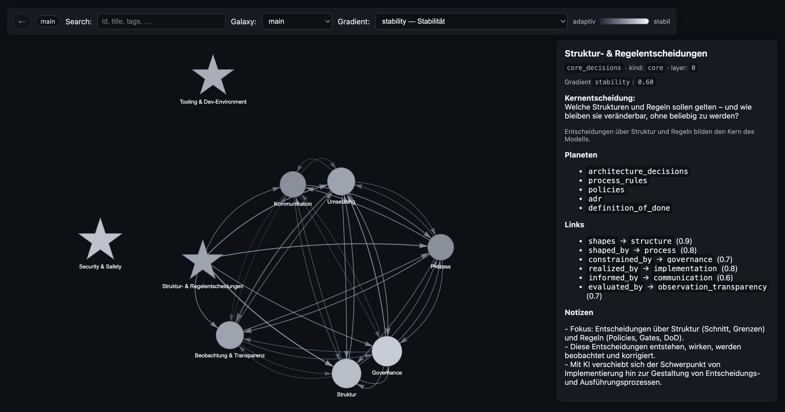

# Process-Based Software Development (PSE) – Knowledge Graph

Dieses Projekt implementiert einen spezifikationsgetriebenen Knowledge Graph für Softwareentwicklungs-Prozesse.

Es verwaltet architektonische Leitplanken, Entscheidungsräume, Security-Grenzen und Agentenrollen in einer maschinenlesbaren und visualisierbaren Struktur.

Der Graph dient als:
- **Denkmodell** für Prozesse & Architektur
- **Internes Transformationswerkzeug**
- **Operatives Wissenssystem**
- **Grundlage** für KI-gestützte Entwicklung

---

## 🚀 Was ist das?

Das Herzstück sind Markdown-Dateien in `knowledge/nodes/`. Diese bilden über Frontmatter-Verknüpfungen einen gerichteten Graphen.

### Entitäten
- **Nodes**: Konzepte, Entscheidungen, Policies
- **Galaxies**: Logische Cluster
- **Gradients**: Spannungsachsen (z. B. *explicitness*, *stability*)

### Automatisierung
Ein Build-Skript (`build.mjs`) erzeugt:
- `dist/graph.json`: Die berechnete Graph-Struktur
- Statische Assets für ein interaktives UI



### Gatekeeper
Validierungsskripte prüfen:
- Keine toten Links
- Gültige Node-IDs
- Konsistente Galaxy-Referenzen

> **Wahrheit liegt in Markdown, nicht im UI.**

---

## 🛠 Starten & Lokale Entwicklung

### Voraussetzungen
- Node.js (v18+)
- npm

### Installation
```bash
npm install
```

### Build & Validierung
```bash
./scripts/knowledge_gate.sh
```
Oder manuell:
```bash
node build.mjs
node scripts/validate_knowledge.mjs
```

### UI betrachten
```bash
npx serve dist
```
Dann [http://localhost:3000](http://localhost:3000) öffnen.

---

## 📥 Workflow – Ideen integrieren

Neue Gedanken oder Erkenntnisse fließen über einen kritischen Inbox-Prozess ein.

### 1. Idee hinzufügen
```bash
./scripts/inbox_add.sh "Titel der Idee" "Beschreibung..."
```
Erzeugt eine Datei in `knowledge/inbox/YYYY-MM-DD_HH-MM-SS.md`.

### 2. Kuratierung (Inbox → Graph)
```bash
./scripts/curate_apply.sh --new
```
Erzeugt einen Bundle-Ordner in `knowledge/inbox/_bundle/<timestamp>/`.

**Ablauf:**
1. `PROMPT.md` öffnen und Inhalt an eine KI übergeben.
2. Den generierten Diff der KI in `AI_OUTPUT.md` einfügen.
3. Änderungen anwenden:
   ```bash
   ./scripts/curate_apply.sh --apply knowledge/inbox/_bundle/<name> --move-done
   ```

Das Skript extrahiert den Diff, validiert den resultierenden Graph und verschiebt die bearbeiteten Inbox-Dateien nach `_done`.

---

## 🧠 KI-Integration

Das System ist explizit für die Zusammenarbeit mit KI ausgelegt:
- KI erzeugt ausschließlich diffbare Artefakte.
- Alle Änderungen müssen die automatisierten Gates passieren.
- Policies und Governance sind versioniert und referenzierbar.

**Zentrales Regelwerk:**
- `specs/constitution.md`
- `specs/ai_policy.md`
- `specs/governance_policy.md`
- `specs/security_policy.md`
- `specs/agent_roles_spec.md`

---

## 🧩 Struktur

```text
.
├── knowledge/
│   ├── nodes/      # Source of Truth (Markdown)
│   ├── galaxies/   # Logische Cluster Definitionen
│   └── inbox/      # Neue Ideen & Kurations-Workspace
├── specs/          # Normative Regeln & Architektur-Policies
├── ui/             # Frontend-Code für die Visualisierung
├── dist/           # Generierte Artefakte (Graph-JSON, static UI)
├── scripts/        # Build, Validierung, Automatisierung
└── build.mjs       # Haupt-Build-Logik
```

---

## 🎯 Ziel

Mit zunehmender KI-Automatisierung verschiebt sich der Engpass von der Implementierung hin zur Gestaltung von Entscheidungs- und Ausführungsprozessen.

Dieses Repository modelliert genau diese Struktur – versioniert, validiert und navigierbar.

---

## ⚠️ Nicht-Ziele

Dieses Projekt ist ausdrücklich **nicht**:
- Ein einfaches Wiki
- Ein generisches BPM-Tool
- Eine reine Chat-Dokumentation
- Eine lose, unstrukturierte Ideensammlung

Es ist ein **strukturierter Entscheidungsgraph mit strenger Gate-Kontrolle**.