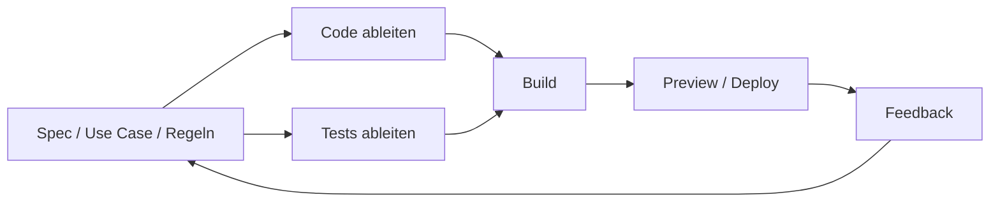
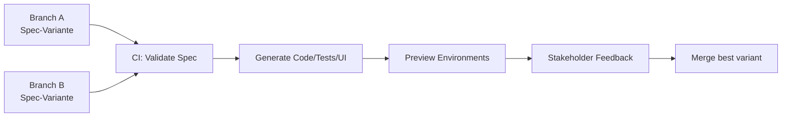
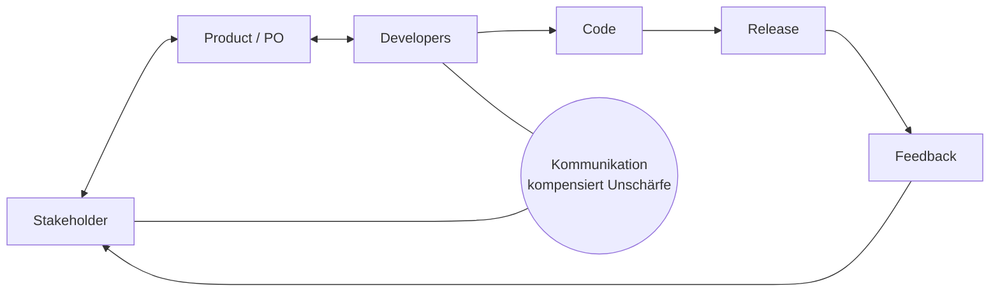
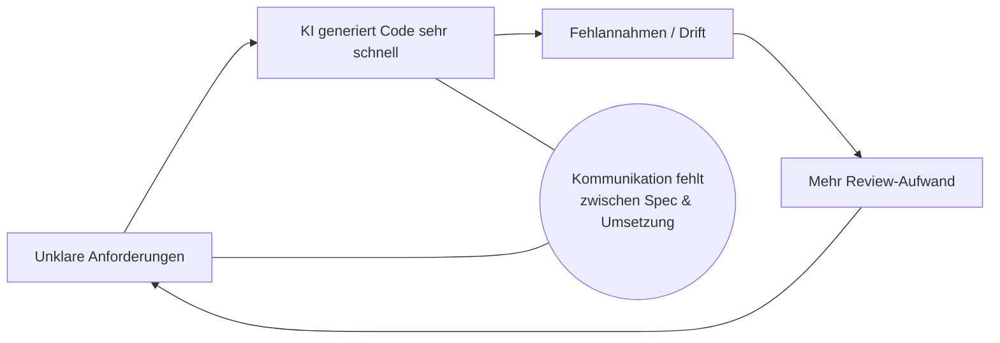

## Präsentationsreifer Foliensatz: KI‑fähige, spec‑getriebene Softwareentwicklung
Struktur, Headlines, Kerninhalte je Folie und prägnante Speaker Notes (deutsch)

---

### Slide 1 — Titel & Ziel
- Spec‑Driven Development: Prozesse für KI‑fähige Softwareentwicklung
- Ziel: Wie Prozesse, Rollen und Artefakte sich ändern müssen, damit KI echte Produktivität bringt

Speaker Notes:
- Heute geht es nicht um einzelne Tools, sondern um Struktur: Wie wir Arbeit so gestalten, dass KI zuverlässig liefert. Kernfrage: Wie werden Entscheidungen explizit, überprüfbar und schnell iterierbar?

---

### Slide 2 — Executive Summary (Thesenfolie)
- Agilität für Menschen = Kommunikation. Agilität für KI = Explizitheit.
- Alles, was nicht explizit ist, existiert für KI nicht.
- Specs sind Quelle der Wahrheit; Code implementiert Specs.
- Review verschiebt sich nach vorne: Entscheidungen/Verhalten prüfen, dann generieren.

Speaker Notes:
- KI skaliert Geschwindigkeit – und Fehler. Der Engpass ist nicht Tippen, sondern Entscheidungsqualität und Explizitheit. Wir verlagern Agilität vom Code zur Entscheidung.

---

### Slide 3 — Warum Wandel: Von codezentriert zu prozessbasiert
- Traditionell: Feature → Ticket → Dev tippt → PR → Review
- Prozessbasiert: Idee → Spec → Validierung → Generierung → Tests → Gates → Review
- 70–80 % mechanische Arbeit ist automatisierbar; Engpass: Architektur, Verträge, Tests

Speaker Notes:
- Rollen wandeln sich: vom „Coder“ hin zu Systemdenker, Prozessdesigner, Qualitäts‑Gatekeeper. Wir designen Systeme, die Code erzeugen, statt alles manuell zu tippen.

---

### Slide 4 — Agilität heute vs. KI‑Bruch
- Heute: Unklarheit → Kommunikation → gemeinsames Verständnis → Code
- Mit KI: Unklarheit → keine Aushandlung → Fehlannahmen → falscher Code (nur schneller)
- Kernaussage: Prozesse, die auf impliziter Kommunikation basieren, sind nicht KI‑fähig

Speaker Notes:
- KI kann nicht „zwischen den Zeilen“ lesen. Unklare Anforderungen führen zu beschleunigter Fehlproduktion. Lösung: Explizite Entscheidungen und maschinenlesbare Artefakte.

---

### Slide 5 — Zwei Agilitäten: Human↔Human, Human↔Machine
- Human↔Human: Gespräche, Aushandlung, Priorisierung
- Human↔Machine: Specs, Regeln, Artefakte (bindend)
- Stakeholder‑Shift: Stakeholder entscheiden; Teams formalisieren; KI setzt um

Speaker Notes:
- Wir trennen Kommunikations‑Agilität (unter Menschen) von Artefakt‑Agilität (für Maschinen). Gespräche enden in Spezifikationen – nicht in Annahmen.

Visual (Mermaid):
```mermaid
flowchart TB
  subgraph HH[Agilität Mensch ↔ Mensch]
    W[Workshops / Gespräche] --> D1[Entscheidungen]
  end
  subgraph HM[Agilität Mensch ↔ Maschine]
    D1 --> S[Specs (Git)]
    S --> G[Generierung (Code/Tests/UI)]
    G --> P[Preview / Running Software]
    P --> L[Learning / Feedback]
    L --> D1
  end
```

---

### Slide 6 — Implizit → Explizit: Der große Shift
- Architektur wird formuliert (nicht „entsteht“)
- Regeln sind geschrieben, Wissen versioniert, Artefakte bindend
- Klarer Schnitt: Was (Git/Specs) vs. Warum (Confluence/ADRs); Jira steuert Arbeit

Speaker Notes:
- „Spec als formalisierte Kommunikation“: Sie ersetzt die Zwischen‑den‑Zeilen‑Intelligenz im Mensch‑Maschine‑Kanal.

---

### Slide 7 — Spec‑Driven Development (SDD): Prinzipien
- Specs = Single Source of Truth; Code implementiert Specs
- Verhaltensänderung → Spec‑Änderung (vorher oder im selben PR)
- Qualität lokal und deterministisch: Format, Lint, Tests, Schema/Docs

Speaker Notes:
- Ziel ist nicht Bürokratie, sondern kontrollierte Komplexität und günstige Evolution. Ohne Spec‑Änderung bleibt Verhalten „zufällig“.

---

### Slide 8 — Wasserfall vs. SDD (Abgrenzung)
- Wasserfall scheitert am späten Feedback, nicht an Specs
- SDD: Spec zuerst und ständig – kleine Spec‑Änderung → sofortige Ableitung → frühes Feedback → Anpassung
- Ziel: Lernfähigkeit statt Vollständigkeitsillusion

Speaker Notes:
- Spec ist Arbeitsmedium, nicht Abschlussdokument. KI macht Ableitungen so billig, dass häufige Iterationen sinnvoll sind.

Visual (Mermaid):
```mermaid
flowchart TB
  subgraph WF[Wasserfall]
    W1[Große Spezifikation] --> W2[Lange Implementierung]
    W2 --> W3[Test am Ende]
    W3 --> W4[Feedback spät]
  end
  subgraph SDD[Spec-Driven (inkrementell)]
    S1[Kleine Spec-Änderung] --> S2[Sofort: Code+Tests+Preview]
    S2 --> S3[Feedback früh]
    S3 --> S1
  end
```

---

### Slide 9 — Tests als ausführbare Specs
- Black‑Box Use‑Case/Command‑Tests statt fragile White‑Box‑Unit‑Tests
- Tests beweisen Akzeptanzkriterien; sichern Verhalten, Verträge, Invarianten
- DoD: ACs sind reproduzierbar grün

Speaker Notes:
- Tests werden zur „laufenden Norm“. Sie schützen Architekturentscheidungen gegen spätere Drift, auch bei KI‑erzeugtem Code.

---

### Slide 10 — Operating Model: KI ist Umsetzer, nicht Teilnehmer
- KI ist kein Teammitglied/Stakeholder; kein Diskussionspartner
- KI = Umsetzer, Varianten‑Generator, Konsequenzverstärker
- Diskussionen bleiben menschlich; Umsetzung wird maschinell

Speaker Notes:
- KI beschleunigt Umsetzung und verstärkt Konsequenzen. Deshalb müssen Entscheidungen klar und testbar sein.

---

### Slide 11 — Workflow: Conversation → Decision → Spec → Generate → Learn
- Gespräche enden in Artefakten (Specs)
- Lernzyklus: entscheiden → spezifizieren → generieren → lernen
- Agilität verschiebt sich: schnell Specs ändern, nicht endlos diskutieren

Speaker Notes:
- Einfache Regel: Kein Ticket ohne referenzierte Spec. Feedback kommt über laufende Previews, nicht nur über Text.

Visual (Mermaid):


---

### Slide 12 — Lokaler Multi‑Agent‑Workflow mit Copilot (Übersicht)
- Prinzipien: Local‑only, Spec as Truth, klare Rollen/Output, deterministische Gates
- Pipeline: Specs → Planner → Implementer → Tester → Reviewer
- Artefakt‑Handoffs (Dateien) statt Chat‑Handoffs

Speaker Notes:
- Alles liegt im Repo (Specs, Instructions, Agent‑Profile). Reproduzierbar, auditierbar, tool‑agnostisch.

---

### Slide 13 — Repo‑Struktur, Agenten & Handoffs
- Struktur:
  - specs/constitution.md; architecture/; features/<f>/{spec, plan, tasks, review}
  - .github/{copilot‑instructions, agents/*}; scripts/{gates, prompts}; Make/just
- Agenten:
  - Architect, Planner, Implementer, Tester, Reviewer (Output‑Verträge)
- Handoffs:
  - Jede Rolle schreibt/liest definierte Dateien; AUTOMATION MODE = diff‑only

Speaker Notes:
- Der „Vertrag“ pro Agent macht Automation robust: einheitliche Patches, klarer Scope, keine impliziten Fragen.

---

### Slide 14 — Qualitätsschranken (Gates) & Orchestrator
- Gates lokal: Format, Lint, Tests, ggf. Schema/Docs; „grün“ ist Definition of Done
- Orchestrator (CLI/Script): Prompts laden, Patch anwenden, Gates ausführen, bei Fehlern gezielt loopen
- State‑Machine: Spec → Plan → Tasks → Implement/Tests‑Loop → Review → PR

Speaker Notes:
- Fokus auf deterministische Abläufe und kleine, reviewbare Änderungen. Fehler werden minimal und lokal gefixt.

---

### Slide 15 — Review‑Shift & Rituale
- Review‑Reihenfolge: Spec Review → Generierung → Abweichungsprüfung → schlanker Code‑Review
- Rituale:
  - Daily: menschlich (Koordination)
  - Refinement: muss in Spec/Tasks münden
  - Retro: bleibt menschlich

Speaker Notes:
- Leitsatz: Code‑Reviews ohne Specs sind Meinungen, keine Qualitätssicherung. Prüfe Verhalten, Grenzen, Regeln zuerst.

---

### Slide 16 — CI/CD als Design‑Pipeline (Previews, Varianten)
- Spec‑Varianten pro Branch; CI validiert → generiert → erstellt Previews
- Stakeholder geben Feedback an laufender Software; beste Variante wird gemerged
- „Show, don’t tell“: schnellere, belastbare Entscheidungen

Speaker Notes:
- Branches sind Entwurfsvarianten. Das senkt Missverständnisse und Entscheidungszeit.

Visual (Mermaid):


---

### Slide 17 — MVP als Verhaltensschnitt
- MVP = minimaler, klarer Verhaltensentwurf (Happy Path)
- Beispiel: „Checkout Happy Path, keine Fehlerbehandlung“
- Nutzen: frühe Validierung von Schnittstellen/Regeln; perfekte Vorlage für KI‑Generierung

Speaker Notes:
- MVP ist Implementierungsstrategie, nicht Spezifikationsstrategie. Specs bleiben vollständig; implementiert wird in Slices.

---

### Slide 18 — Brownfield: SpecKit vs. BMAD
- Brownfield‑Realität: implizite Architektur, kleine Änderungen, lokale Entscheidungen
- SpecKit: leichtgewichtig, feature‑lokale Mini‑Specs + Constraints + Tasks → optimal
- BMAD: zu schwer für Brownfield; gut bei Neubauten/Epics

Speaker Notes:
- Empfehlung: Dünne SpecKit‑Schicht statt Rollenspiel‑Overhead. Ziel: „Fix Verhalten X, brich Y nicht“, mit klaren Tests.

---

### Slide 19 — Anti‑Patterns & Risiken
- „Wir prompten uns zum Feature“ ohne Spec → Drift, Rework, Bottleneck
- Confluence/Jira als Spec‑Quelle → Widersprüche, keine Automation
- SDD kippt bei Spec‑Freeze, ignoriertem Feedback, politisierten Änderungen

Speaker Notes:
- Kurzfristig wirkt Explizitheit wie Overhead; mittel‑/langfristig reduziert sie Rework drastisch. KI verstärkt schlechte Prozesse – oder gute.

---

### Slide 20 — How to Start (30‑Tage‑Plan) + Metriken
- Woche 1: 1–2 Use‑Cases als Specs in Git; Constitution aufsetzen
- Woche 2: Tests aus Specs ableiten; Gates verdrahten
- Woche 3: Previews je Branch/PR; Spec Review zur Pflicht machen
- Woche 4: Kleines Feature im Copilot‑Workflow umsetzen; review.md; Retro
- Metriken: Zeit bis Preview, Spec‑Änderungen/Woche, Rework‑Quote, Gate‑Stabilität

Speaker Notes:
- Start klein, aber vollständig: Ein End‑to‑End‑Slice mit echter Preview überzeugt Stakeholder und Team.

---

## Anhang A — Visualbibliothek (Mermaid zum Copy/Paste)
- Agilität heute

- KI verstärkt Unklarheit


---

## Anhang B — Checklisten & Templates (Auszug)
- Spec‑Review Checkliste:
  1) Systemgrenze klar? 2) Vor/Nachbedingungen vollständig? 3) Fehlerpfade definiert? 4) Invarianten explizit? 5) Inputs/Outputs testbar? 6) Mehrdeutigkeiten eliminiert?
- Minimaler Use‑Case‑Spec:
  - Kontext/Ziel; Vorbedingungen; Hauptablauf (beobachtbares Verhalten); Alternativen/Fehlerpfade; Nachbedingungen; Invarianten
- Task‑Block (Planner):
  - Status; Goal; Acceptance Criteria; Required Tests; Likely Areas/Files; Dependencies

---

## Optionaler Praxis‑Anhang C — Repo‑Template (Struktur)
- specs/: constitution.md, architecture/, features/<feature>/{spec.md, plan.md, tasks.md, review.md}
- .github/: copilot‑instructions.md; agents/* (architect/planner/implementer/tester/reviewer)
- scripts/: gates/{format.sh, lint.sh, test.sh}; prompts/*; auto_workflow.py
- Makefile/justfile; README.md

Speaker Notes:
- Damit ist der lokale Multi‑Agent‑Flow sofort lauffähig; Gates an Ihren Stack (Node/Rust/Java/…) anpassen.

---

Kleiner, sofort umsetzbarer Tipp: Fangen Sie mit genau einem Use‑Case (Happy Path) an und führen Sie in der dritten Woche bereits Previews pro Branch ein – das erzeugt schnell sichtbaren Mehrwert für Stakeholder.

