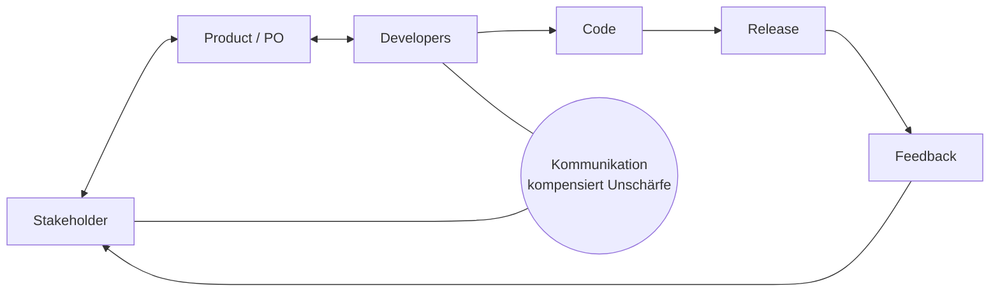
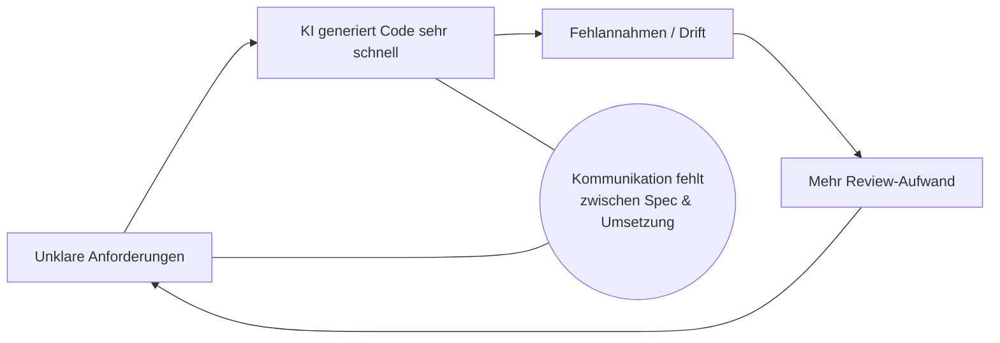
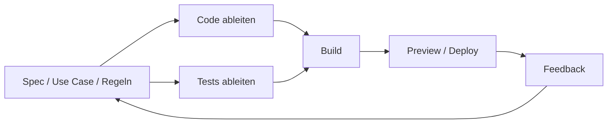
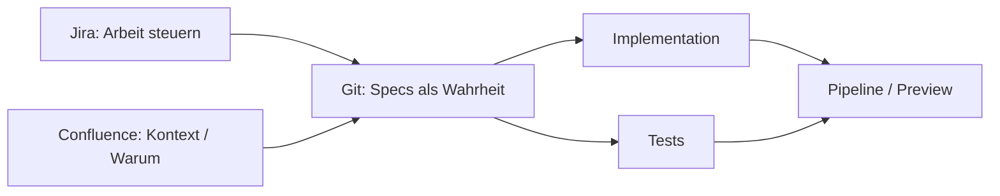
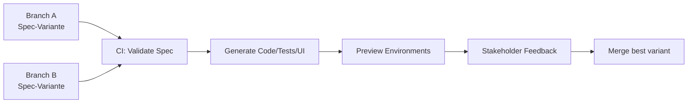
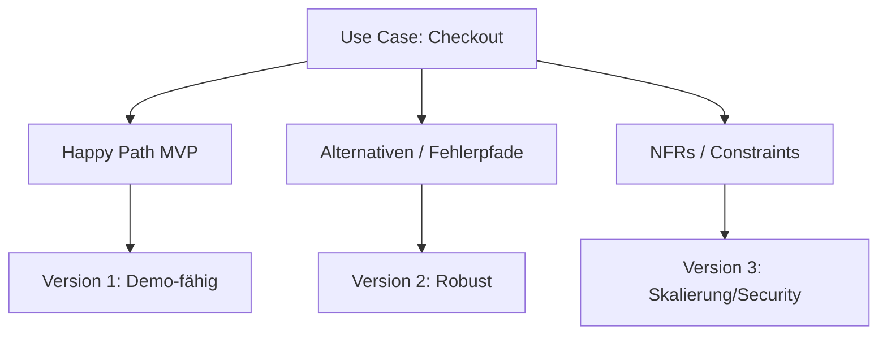

# Prozessgrafiken für den Vortrag

1. **Ist-Zustand greifbar machen** (wo Agilität heute herkommt)
2. **KI-Bruchstellen sichtbar machen** (warum aktuelle Prozesse nicht skalieren)
3. **Zielbild ableiten** (welche neuen Formen sinnvoll sind)
4. **Konkrete Ansätze** (wie man es im Team einführt)

Und ja: **Prozessgrafiken** sind dafür ideal. Unten bekommst du eine **Sammlung von Diagrammen**, die du als Folien 1:1 übernehmen kannst (Mermaid, copy/paste).

---

## Grafik 1 – „Agilität heute“ (Kommunikation als Klebstoff)



**Message:** Agil funktioniert, weil Menschen Unklarheit durch Kommunikation ausgleichen.

---

## Grafik 2 – „KI verstärkt Unklarheit“ (der Bruch)



**Message:** Ohne explizite Entscheidungen produziert KI „falsche Geschwindigkeit“.

---

## Grafik 3 – „Zwei Agilitäten“ (Human↔Human vs Human↔Machine)

```mermaid
flowchart TB
  subgraph HH[Agilität Mensch ↔ Mensch]
    W[Workshops / Gespräche] --> D1[Entscheidungen]
  end

  subgraph HM[Agilität Mensch ↔ Maschine]
    D1 --> S[Specs (Git)]
    S --> G[Generierung (Code/Tests/UI)]
    G --> P[Preview / Running Software]
    P --> L[Learning / Feedback]
    L --> D1
  end
```

**Message:** Agilität bleibt – aber wird **zweigeteilt**: Kommunikation für Menschen, Artefakte für Maschinen.

---

## Grafik 4 – „SDD Regelkreis“ (Spec ist das Steuerungsrad)



**Message:** Nicht „Spec als Phase“, sondern **Spec als Iterationsmittelpunkt**.

---

## Grafik 5 – „Wasserfall vs SDD“ (Warum es nicht dasselbe ist)

```mermaid
flowchart TB
  subgraph WF[Wasserfall]
    W1[Große Spezifikation] --> W2[Lange Implementierung]
    W2 --> W3[Test am Ende]
    W3 --> W4[Feedback spät]
  end

  subgraph SDD[Spec-Driven (inkrementell)]
    S1[Kleine Spec-Änderung] --> S2[Sofort: Code+Tests+Preview]
    S2 --> S3[Feedback früh]
    S3 --> S1
  end
```

**Message:** Wasserfall = spät validieren. SDD = **schnell validieren**.

---

## Grafik 6 – „Tool-Rollen sauber trennen“ (Git / Jira / Confluence)



**Message:** Git ist normativ. Jira organisiert. Confluence erklärt.
(Kein Drift, klare Zuständigkeit.)

---

## Grafik 7 – „Review verschiebt sich nach vorne“ (Spec Review > Code Review)

```mermaid
flowchart TB
  SR[Spec Review<br/>(Verhalten, Grenzen, Regeln)] --> GEN[Generierung]
  GEN --> DIFF[Abweichungen prüfen<br/>(Spec ↔ Code)]
  DIFF --> CR[Minimaler Code Review<br/>(Risiken, Integration)]
  CR --> MERGE[Merge]
```

**Message:** Menschen reviewen Entscheidungen/Verhalten – KI übernimmt Fleißarbeit.

---

## Grafik 8 – „CI/CD wird Design-Pipeline“ (Feature-Branches + Previews)



**Message:** Branches sind nicht nur Code-Isolation, sondern **Entwurfsvarianten**.

---

## Grafik 9 – „MVP als Verhaltensschnitt“ (nicht Feature-Liste)



**Message:** MVP = minimaler *Verhaltensentwurf*, nicht „halb fertiges Feature“.

---

## Grafik 10 – „Zielbild: AI-native Delivery Operating Model“

```mermaid
flowchart TB
  subgraph INPUT[Input Layer]
    H[Human Communication<br/>Workshops/Discovery]
    D[Decisions]
    H --> D
  end

  subgraph SPEC[Spec Layer (Git)]
    S[Specs / Use Cases / Glossar]
    D --> S
  end

  subgraph EXEC[Execution Layer]
    A[Agents / Skills]
    S --> A
    A --> ART[Code + Tests + Docs]
  end

  subgraph RUN[Run & Learn]
    CI[CI/CD + Previews]
    ART --> CI
    CI --> FB[Feedback Metrics & Review]
    FB --> D
  end
```

**Message:** Das ist das „Betriebssystem“ der zukünftigen Entwicklung: Entscheiden → Spezifizieren → Generieren → Lernen.

---

# Die entscheidenden neuen Ansätze (als „Ableitungen“ aus den Grafiken)

Hier sind die **Ansätze**, die du aus den Gegenüberstellungen logisch ableiten kannst (das ist in deinem Vortrag der wichtigste Part):

### 1) **Artifact-First Agility**

Agilität bedeutet künftig primär: **Artefakte schnell ändern** (Specs), nicht „darüber reden bis es passt“.

### 2) **Dual-Track: Human / Machine**

* Human: Discovery, Aushandlung, Priorisierung
* Machine: Umsetzung, Varianten, Ableitung von Tests/UI

### 3) **Spec Ownership & Governance**

Specs sind „Gesetz“ → brauchen Ownership, Reviews, Policies.

### 4) **Review-Shift**

Spec Review ist der Hauptreview. Code Review wird schlanker und risikofokussiert.

### 5) **CI/CD als Design-System**

Previews pro Branch + schnelle Varianten = bessere Kundenkommunikation als Tickets.

### 6) **MVP als Verhaltensschnitt**

MVP wird „minimaler Ablauf“, nicht „halb implementiertes Feature“.

---

# Wie du daraus einen stringenten Vortrag baust (ohne Overhead)

**Vorschlag Folienabfolge (12–15 Slides):**

1. Agilität heute (Grafik 1)
2. KI-Bruchstellen (Grafik 2)
3. Zwei Agilitäten (Grafik 3)
4. SDD-Loop (Grafik 4)
5. Wasserfall-Abgrenzung (Grafik 5)
6. Tool-Rollen (Grafik 6)
7. Review-Shift (Grafik 7)
8. CI/CD als Design-Pipeline (Grafik 8)
9. MVP als Verhalten (Grafik 9)
10. Zielbild (Grafik 10)
11–15. Neue Ansätze + „How to start“

---

## Wenn du willst, mache ich dir als nächstes (ohne lange Rückfragen)

* eine **„How to start“-Folie**: 30 Tage Umstellung in 5 Schritten
* eine **Policy-Folie**: „No Spec, no merge“ + sinnvolle Ausnahmen
* eine **konkrete Repo-Template-Struktur** (`/specs`, `/use-cases`, `/commands`)
* oder ich setze dir das direkt als **fertigen Foliensatz-Text (Slide Headlines + Speaker Notes)** um.

Sag einfach: **„Mach Folien-Headlines + Speaker Notes“** oder **„Mach 30-Tage-Plan“**.
